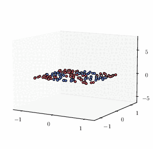
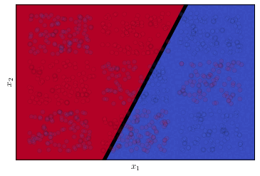

<!-- Title -->
<h1 align="center">
  Leia: Learning with EvolutIon equAtions
</h1>

<!-- Information badges -->
<p align="center">
  
  <a href="https://www.repostatus.org/#concept">
    
  </a>
  <a href="https://doi.org/10.1017/S0962492922000046">
  
  </a>
</p>

<p align="center">
  
  &nbsp;
  &nbsp;
  &nbsp;
  
</p>

A <tt>PyTorch</tt> toolbox for solving learning tasks with neural ODEs. An important element of this toolbox is that it allows for time-dependent weights (controls), and costs involving integrals of the state. Generally speaking, there is flexibility in using different functionals and weight penalties (beyond simply $L^2$, for instance).

A sample experiment may be found in <tt>generate_fig.py</tt>, with the main modules being a simple instantiation of the neural ODE

```python
anode = NeuralODE(device, 
                  data_dim, 
                  hidden_dim, 
                  augment_dim=1, 
                  non_linearity='relu',
                  architecture='bottleneck', 
                  T=T, 
                  time_steps=num_steps, 
                  fixed_projector=False, 
                  cross_entropy=cross_entropy)
```
and then of the optimization algorithm

```python
trainer_anode = Trainer(anode, 
                        optimizer_anode, 
                        device, 
                        cross_entropy=cross_entropy, 
                        turnpike=turnpike,
                        bound=bound, 
                        fixed_projector=fp)
```

## Citing 

If you are using this toolbox for your scientific publication, we would be very appreciative if you were to cite one of our following articles on this topic.

1. **Turnpike in optimal control of PDEs, ResNets, and beyond**

```
@article{geshkovski2022turnpike,
  title={Turnpike in optimal control of PDEs, ResNets, and beyond},
  author={Geshkovski, Borjan and Zuazua, Enrique},
  journal={Acta Numerica},
  volume={31},
  pages={135--263},
  year={2022},
  publisher={Cambridge University Press}
}
```

2. **Large-time asymptotics in deep learning**

```
@article{esteve2021large,
  title={Large-time asymptotics in deep learning},
  author={Esteve-Yag{\"u}e, Carlos and Geshkovski, Borjan and Pighin, Dario and Zuazua, Enrique},
  year={2021}
}
```

3. **Sparse approximation in learning via neural ODEs**

```
@article{esteve2023sparsity,
  title={Sparsity in long-time control of neural ODEs},
  author={Esteve-Yag{\"u}e, Carlos and Geshkovski, Borjan},
  journal={Systems \& Control Letters},
  volume={172},
  pages={105452},
  year={2023},
  publisher={Elsevier}
}
```

<!-- ## Improvements

The toolbox can be improved by further adding the following functionalities: 
- Weight clipping for bottleneck architectures to ensure $L^1$ and $L^\infty$ constraints.
- Time-dependent weights for non-uniform time-stepping. -->
